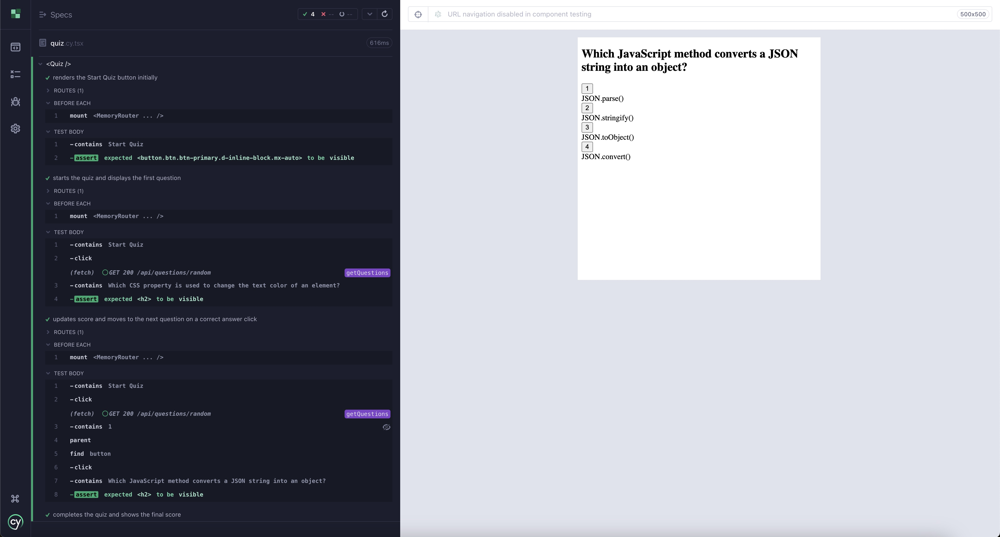
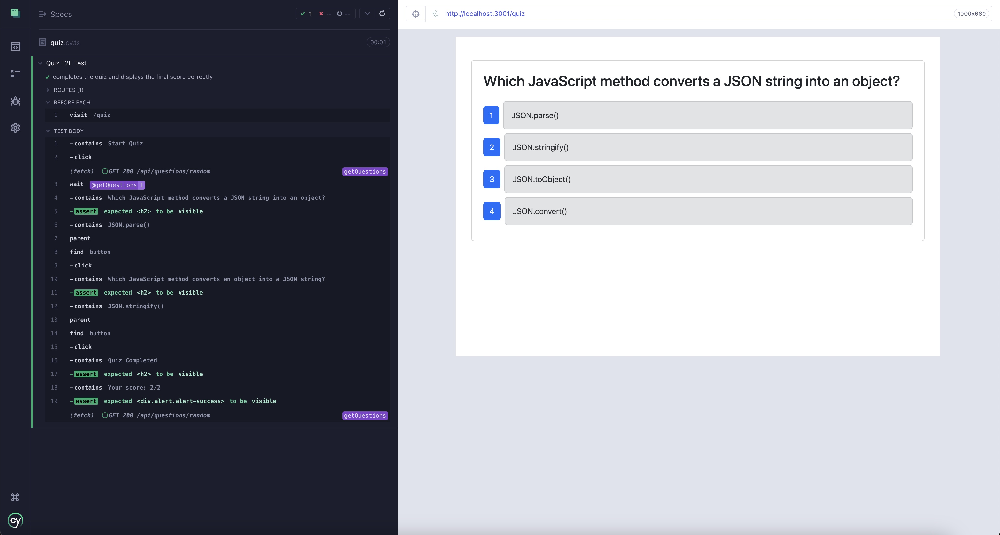

# Testing Tech Quiz App With Cypress

[](https://nodejs.org/)
[](https://www.cypress.io/)
[](https://opensource.org/licenses/MIT)

[](https://expressjs.com/)
[](https://www.typescriptlang.org/)
[](https://reactjs.org/)
[](https://www.mongodb.com/)

## Description

The Tech Quiz Application is a dynamic full-stack web app designed to challenge and engage users with coding and technology-related quizzes. Built with a modern MERN stack, this application not only offers a fun user experience but also emphasizes reliability and robustness through comprehensive testing.

Testing is a critical part of the development process—ensuring that our application meets user demands and performs efficiently under various conditions. Our testing strategy uses Cypress to run both component tests and end-to-end tests, keeping our code rock-solid.

## Features

- **Interactive Quiz Interface:**

  A responsive and intuitive user interface built with React.

- **Dynamic Question Loading:**

  Questions are fetched from the server, allowing for an ever-evolving quiz experience.

- **Robust State Management:**
  
  Ensures smooth transitions between questions, accurate scoring, and seamless user experience.

- **Comprehensive Testing:**
  
  Utilizes Cypress for both component and end-to-end testing, ensuring reliability and robustness.

- **Modern Full-Stack Architecture:**
  
  Built on a MERN stack, integrating client-side React with a server-side Express application.

## Table Of Contents

- [Testing Tech Quiz App With Cypress](#testing-tech-quiz-app-with-cypress)
  - [Description](#description)
  - [Features](#features)
  - [Table Of Contents](#table-of-contents)
  - [Installation](#installation)
  - [Usage](#usage)
    - [Starting the Server and Running Tests](#starting-the-server-and-running-tests)
    - [Run Cypress Tests](#run-cypress-tests)
    - [Project Structure](#project-structure)
    - [Preview Images of Tests Running in Cypress GUI](#preview-images-of-tests-running-in-cypress-gui)
  - [Contributing](#contributing)
  - [License](#license)
  - [Tests](#tests)
  - [Questions](#questions)

## Installation

1. **Clone the repository:**

   ```bash
   git clone https://github.com/snabaj/testing-with-cypress.git
   cd tesitng-with-cypress
   ```

2. Install dependencies:

   ```
   npm install
   ```

3. Install Cypress:

   ```
   npm install -D cypress
   ```

4. Build the Project:
   ```
   npm run build
   ```

## Usage

### Starting the Server and Running Tests

Start the development server:

```
npm run start:dev
```

### Run Cypress Tests

Run both component tests and end-to-end tests with:

```
npm run test
```

For an interactive testing experience, launch the Cypress GUI with:

```
npm run cypress
```

### Project Structure

```
project-folder/
├── client/
│   ├── src/
│   │   ├── components/
│   │   └── assets/
│   └── public/
├── server/
│   ├── app.ts
│   └── routes/
├── cypress/
│   ├── component/
│   │   └── Quiz.cy.tsx
│   ├── e2e/
│   │   └── quiz.cy.ts
│   ├── fixtures/
│   │   └── questions.json
│   └── tsconfig.json
├── cypress.config.ts
├── tsconfig.json
└── package.json
```

### Preview Images of Tests Running in Cypress GUI

**Component Test**



**E2E Test**



<!-- ### Video Showing Testing of the App in the Command Line and Cypress GUI

[video of testing](client/src/assets/testing-cypress.mov) -->

## Contributing

Contributions are welcome! To contribute:

1. Fork the repository.

2. Create a new branch:
   ```
   git checkout -b feature/your-feature
   ```
3. Make your changes and commit:
   ```
   git commit -m "Add feature: description"
   ```
4. Push your branch:
   ```
   git push origin feature/your-feature
   ```
5. Open a pull request.

Ensure that your code is well-documented and tested before submitting a pull request.

## License

This project is licensed under the [MIT](https://opensource.org/licenses/MIT) license.

## Tests

You may also add your own testing frameworks or unit tests as necessary.

## Questions

Please contact me with any questions you may have at [snabajja@gmail.com](mailto:snabajja@gmail.com) or visit my GitHub profile at [snabaj](https://github.com/snabaj).
